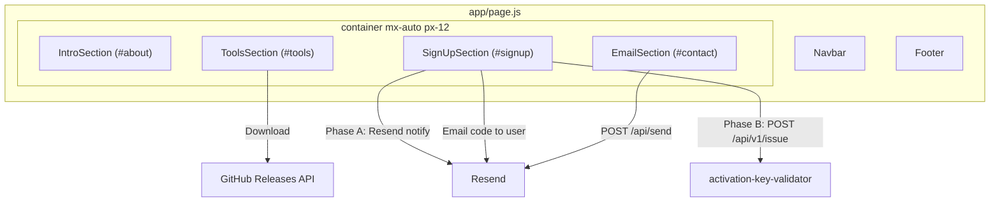
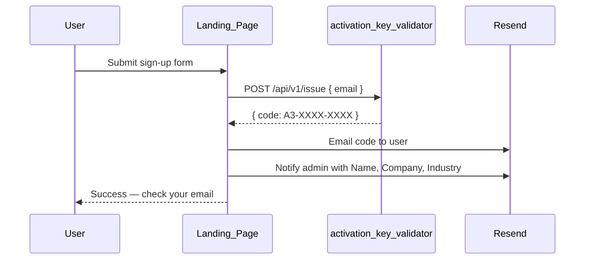

# Project A3 Landing Page Build Plan

## Current state

[`portfolio-project-a3`](D:/git_repos/portfolio-project-a3) is documentation-only today ([`AGENTS.md`](D:/git_repos/portfolio-project-a3/AGENTS.md), [`README.md`](D:/git_repos/portfolio-project-a3/README.md)). All UI and config must be created from scratch.

**Content source of truth:** [`D:/git_repos/project-a3/`](D:/git_repos/project-a3/) — product identity, tool specs, sign-up fields, activation contract, brand tokens.

**Visual/styling source of truth:** [`D:/git_repos/portfolio-alvinchiew/frontend/`](D:/git_repos/portfolio-alvinchiew/frontend/) (live: [alvinchiew.com](https://alvinchiew.com))

**Styling guide:** [`.cursor/skills/portfolio-styling/SKILL.md`](D:/git_repos/portfolio-project-a3/.cursor/skills/portfolio-styling/SKILL.md)

**Brand/copy guide:** [`project-a3/.cursor/skills/a3-brand/SKILL.md`](D:/git_repos/project-a3/.cursor/skills/a3-brand/SKILL.md), [`build-lead-magnet/SKILL.md`](D:/git_repos/project-a3/.cursor/skills/build-lead-magnet/SKILL.md)

---

## What is Project A3 (from `project-a3`)

From [`project-a3/AGENTS.md`](D:/git_repos/project-a3/AGENTS.md):

> This project aims to build a series of small and simple AI and/or Automation utility tools that solves a small business problem at a time. The tools are given away for free but act as lead magnets in return to build fame on social media channels and create inquiries for business opportunities. A3 stands for Alvin • AI • Automation.

**Product principles** (inform intro copy):

- Made simple, minimal, friendly for **non-technical users**
- **Self-managed** on user's device — data stays local
- **Free**, no paid subscriptions; BYOK where APIs needed
- Progressive series: `ep01-*`, `ep02-*`, … (only **ep01** shipped today)

**Identity & taglines** (from [`project-a3/README.md`](D:/git_repos/project-a3/README.md)):

| EN                                    | ZH                                    |
| ------------------------------------- | ------------------------------------- |
| Project A3 \| Alvin • AI • Automation | 大艾与AI                              |
| Made Simple. For Business             | 用简单AI自动化，解决企业痛点          |
| 🚀 Showcase FRI · 🔨 Build TUES       | 🚀 周五：工具展示 · 🔨 周二：实操搭建 |

**Target URL:** [project-a3.alvinchiew.com](https://project-a3.alvinchiew.com) — already hardcoded in ep01 app UI; ep01 `ACTIVATION_URL` env default is `https://alvinchiew.com/a3` and should be updated to `#signup` on this site after deploy.

---

## Target page structure



| Section                   | Source                                          | Notes                                                                                                                                            |
| ------------------------- | ----------------------------------------------- | ------------------------------------------------------------------------------------------------------------------------------------------------ |
| Navbar / Footer / Contact | Copy from reference                             | Contact = full [`EmailSection.jsx`](D:/git_repos/portfolio-alvinchiew/frontend/app/sections/EmailSection.jsx) (form + social links)              |
| Project A3 intro          | **New** — content from `project-a3`             | Mission, principles, bilingual taglines                                                                                                          |
| Tools showcase            | **New** — ep01 data from `project-a3`           | Only one real tool today; future tools from [`Topics.md`](D:/git_repos/project-a3/Topics.md) as "coming soon" optional                           |
| Sign-up form              | **New** — fields from `build-lead-magnet` skill | Integrates with planned [`activation-key-validator`](D:/git_repos/project-a3/.cursor/plans/activation_key_validator_build_plan_a7f3c2b1.plan.md) |

**Navbar links** (edit `navLinks` only in copied Navbar):

```js
{ title: "About", path: "#about" },
{ title: "Tools", path: "#tools" },
{ title: "Sign Up", path: "#signup" },
{ title: "Contact", path: "#contact" },
```

---

## Styling: portfolio shell + A3 accents

**Page shell** follows portfolio tokens (`backdrop` `#121212`, etc.) per portfolio-styling skill.

**A3 brand accents** in Project A3–specific sections (hero, tool cards) per [`a3-brand/SKILL.md`](D:/git_repos/project-a3/.cursor/skills/a3-brand/SKILL.md):

| Token        | Value     | Usage                                       |
| ------------ | --------- | ------------------------------------------- |
| Navy         | `#061931` | Tool card backgrounds, optional hero accent |
| Accent       | `#61e692` | CTAs, highlights (matches ep01 `logo.svg`)  |
| Primary text | `#ffffff` | Headings on navy surfaces                   |

Copy [`ep01-auto-email-follow-up/assets/logo.svg`](D:/git_repos/project-a3/ep01-auto-email-follow-up/assets/logo.svg) to `public/tools/auto-email-logo.png`. Note: `project-a3/assets/images/logo-brand.png` is referenced in brand skill but **missing from repo** — use `logo.svg` until master brand PNG is added.

---

## Phase 1 — Scaffold Next.js app

**Goal:** Runnable dev server with matching theme, no custom sections yet.

1. Initialize at **repo root** (not `frontend/` subfolder — this repo is a single-purpose landing page; simpler Vercel deploy).

   ```bash
   npx create-next-app@14.1.3 . --js --tailwind --eslint --app --no-src-dir --import-alias "@/*"
   ```

2. Trim [`package.json`](D:/git_repos/portfolio-alvinchiew/frontend/package.json) deps to essentials only:
   - **Runtime:** `next@14.1.3`, `react`, `react-dom`, `@heroicons/react`, `resend`
   - **Dev:** `tailwindcss`, `postcss`, `autoprefixer`, `eslint`, `eslint-config-next`
   - **Skip:** `framer-motion`, `react-type-animation`, `react-animated-numbers`

3. Copy config and theme verbatim from reference:
   - [`tailwind.config.js`](D:/git_repos/portfolio-alvinchiew/frontend/tailwind.config.js) — optionally extend with A3 navy/accent tokens
   - [`postcss.config.js`](D:/git_repos/portfolio-alvinchiew/frontend/postcss.config.js)
   - [`app/globals.css`](D:/git_repos/portfolio-alvinchiew/frontend/app/globals.css)
   - [`next.config.mjs`](D:/git_repos/portfolio-alvinchiew/frontend/next.config.mjs), [`jsconfig.json`](D:/git_repos/portfolio-alvinchiew/frontend/jsconfig.json)

4. Copy [`app/layout.js`](D:/git_repos/portfolio-alvinchiew/frontend/app/layout.js); update metadata:
   - **title:** `Project A3 | A3计划 | 大艾与AI`
   - **description:** `Alvin • AI • Automation — Made Simple, For Business. Free desktop tools for small business.`

5. Copy shared components and assets:
   - `app/components/Navbar.jsx`, `NavLink.jsx`, `MenuOverlay.jsx`, `Footer.jsx`
   - `app/sections/EmailSection.jsx`
   - `app/api/send/route.js`
   - `public/*-icon.svg` (5 social icons)

6. Wire minimal [`app/page.js`](D:/git_repos/portfolio-alvinchiew/frontend/app/page.js) shell with EmailSection only.

7. Add `.env.local.example`:

   | Variable                   | Purpose                                                    |
   | -------------------------- | ---------------------------------------------------------- |
   | `RESEND_API_KEY`           | Resend API key (contact + sign-up emails)                  |
   | `FROM_EMAIL`               | Verified sender (e.g. `contact.project.a3@alvinchiew.com`) |
   | `ACTIVATION_ISSUE_URL`     | _(Phase B)_ Validator `POST /api/v1/issue` URL             |
   | `ACTIVATION_ISSUE_API_KEY` | _(Phase B)_ Bearer token for validator                     |

**Checkpoint:** `npm run dev` — page matches portfolio dark theme; Contact form submits to `/api/send` when env vars are set.

---

## Phase 2 — Project A3 intro section

**File:** `app/sections/IntroSection.jsx`  
**Anchor:** `id="about"`

**Content** from [`project-a3/README.md`](D:/git_repos/project-a3/README.md) + [`AGENTS.md`](D:/git_repos/project-a3/AGENTS.md):

- **H1:** `Project A3` with subtitle `Alvin • AI • Automation`
- **Motto:** `Made Simple, For Business.`
- **Social rhythm:** `🚀 Showcase FRI · 🔨 Build TUES`
- **Chinese block:** `大艾与AI` + `用简单AI自动化，解决企业痛点` + `🚀 周五：工具展示 · 🔨 周二：实操搭建`
- **Mission paragraph:** free, local-first desktop tools; one business problem at a time; lead magnets for social reach and business inquiries
- **Principles bullets:** non-technical friendly, self-managed/local data, free/BYOK, progressive tool series

**CTAs:**

- Primary: `#tools` — "Explore tools"
- Secondary: `#signup` — "Free Activation Code"

**Styling:** portfolio typography + optional A3 accent `#61e692` on gradient CTAs; `pt-24 lg:pt-28` for fixed navbar.

---

## Phase 3 — Tools showcase (real ep01 data)

**Files:**

- `app/sections/ToolsSection.jsx` — section heading + responsive grid
- `app/components/ToolCard.jsx` — adapted from reference [`ProjectCard.jsx`](D:/git_repos/portfolio-alvinchiew/frontend/app/components/ProjectCard.jsx)
- `app/data/tools.js` — config array sourced from `project-a3`

**Anchor:** `id="tools"`

### Tool 1: Auto Email (ep01) — available now

From [`ep01-auto-email-follow-up/README.md`](D:/git_repos/project-a3/ep01-auto-email-follow-up/README.md):

| Field           | Value                                                                                 |
| --------------- | ------------------------------------------------------------------------------------- |
| **Name**        | Auto Email                                                                            |
| **Version**     | 1.0.0                                                                                 |
| **Tagline**     | Made Simple, For Business.                                                            |
| **Description** | Lightweight desktop app for scheduling and sending email follow-up sequences          |
| **Platform**    | Windows desktop (Tauri 2)                                                             |
| **Logo**        | Copy `ep01-auto-email-follow-up/assets/logo.svg` → `public/tools/auto-email-logo.png` |

**Feature bullets** (card body):

- Multi-day email campaigns with text + attachments
- CSV recipient import
- BYOK SMTP (Gmail, Outlook, custom)
- Campaign status tracking; export send logs
- Fully local — data stays on your device

**Links:**

| Link         | URL / approach                                                                                                                                                                                                                           |
| ------------ | ---------------------------------------------------------------------------------------------------------------------------------------------------------------------------------------------------------------------------------------- |
| **Download** | Resolve from GitHub Releases API: `https://api.github.com/repos/alvinchiew/project-a3/releases/latest` → asset `Auto Email_1.0.0_x64-setup.exe` (per [`USER_GUIDE.md`](D:/git_repos/project-a3/ep01-auto-email-follow-up/USER_GUIDE.md)) |
| **GitHub**   | `https://github.com/alvinchiew/project-a3`                                                                                                                                                                                               |
| **Video**    | **Not in repo** — hide video overlay until URL provided; or placeholder `#` with tooltip "Coming soon"                                                                                                                                   |

**Conversion hook** (below card, from `build-lead-magnet` skill):

> Want follow-ups wired to your CRM? The A3 team integrates this into your sales stack — sequences, tracking, and automation tailored to your business.

**Optional:** Show "Coming soon" cards for future tools listed in [`Topics.md`](D:/git_repos/project-a3/Topics.md) (Auto WhatsApp follow-up, AI reply, etc.) — greyed out, no download link.

### `app/data/tools.js` structure

```js
export const tools = [
  {
    id: 'ep01',
    name: 'Auto Email',
    status: 'available',
    version: '1.0.0',
    tagline: 'Made Simple, For Business.',
    description: 'Schedule and send multi-day email follow-up sequences...',
    features: [
      /* bullets above */
    ],
    logo: '/tools/auto-email-logo.png',
    downloadUrl: null, // resolved at build/runtime from GitHub Releases
    githubUrl: 'https://github.com/alvinchiew/project-a3',
    videoUrl: null,
    conversionHook: 'Want follow-ups wired to your CRM? ...',
  },
  // optional coming-soon entries from Topics.md
];
```

**Download resolution:** Server-side or client fetch of GitHub Releases API at build time or on page load; fallback link to GitHub Releases page if asset name differs.

---

## Phase 4 — Activation sign-up form

**File:** `app/sections/SignUpSection.jsx`  
**Anchor:** `id="signup"` — this is the target for ep01 `ACTIVATION_URL` (`https://project-a3.alvinchiew.com#signup`)

**Copy** (from [`build-lead-magnet/SKILL.md`](D:/git_repos/project-a3/.cursor/skills/build-lead-magnet/SKILL.md)):

```
Get your Free Activation Code
Free for your business. Takes under a minute.

Welcome to Auto Email — free for your business.
Get free activation code in under a minute.
```

**Form fields** (align with ep01 [`USER_GUIDE.md`](D:/git_repos/project-a3/ep01-auto-email-follow-up/USER_GUIDE.md) and validator plan):

| Field          | Type  | Required                                     |
| -------------- | ----- | -------------------------------------------- |
| Name           | text  | yes                                          |
| Business email | email | yes                                          |
| Company        | text  | yes                                          |
| Industry       | text  | yes (free text — no predefined list in repo) |

**Activation context** (helper text below form):

- Code format: `A3-XXXX-XXXX`
- Grace period (handled in desktop app): 1 campaign, up to 5 emails without a code
- Privacy: "Your data stays on your device" (local-first tool principle)

**Styling:** same input/button classes as EmailSection (portfolio-styling skill).

### Backend — two-phase approach

#### Phase A (ship first): Resend interim flow

New `app/api/signup/route.js`:

1. Validate required fields + business email format
2. Send **admin notification** to `FROM_EMAIL` with all sign-up fields
3. Send **user confirmation** email: "Thanks — free activation code is on its way" (manual follow-up until validator ships)
4. Return 200; show green success in UI

#### Phase B (when validator ships): Full automated flow

Per [`activation_key_validator_build_plan`](D:/git_repos/project-a3/.cursor/plans/activation_key_validator_build_plan_a7f3c2b1.plan.md):



- Landing calls `ACTIVATION_ISSUE_URL` with `{ email }` (validator derives code from HMAC + salt)
- Landing owns Name, Company, Industry — included in admin notification only
- Landing sends activation code to user via Resend
- Validator persists issued codes in SQLite; desktop apps call `POST /api/v1/validate`

**Design Phase A API route** so Phase B only adds validator call + code email — no UI changes.

---

## Phase 5 — Integrate page and polish

Update `app/page.js`:

```jsx
<IntroSection />
<ToolsSection />
<SignUpSection />
<EmailSection />
```

**Footer:** brand text → `Project A3 | A3计划` or `Alvin Chiew — Project A3`

**Navbar brand:** link to `#about`

**Cross-repo alignment after deploy:**

- Set ep01 `ACTIVATION_URL=https://project-a3.alvinchiew.com#signup` in build/release config
- Confirm ep01 in-app "Free Activation Code" link opens `#signup`

---

## Phase 6 — Deploy to Vercel

1. Connect GitHub repo to Vercel; root directory = repo root.
2. Env vars: `RESEND_API_KEY`, `FROM_EMAIL`; later `ACTIVATION_ISSUE_URL`, `ACTIVATION_ISSUE_API_KEY`.
3. Custom domain: `project-a3.alvinchiew.com`.
4. `npm run build` locally before first deploy.

---

## File tree (expected outcome)

```
portfolio-project-a3/
├── app/
│   ├── api/
│   │   ├── send/route.js
│   │   └── signup/route.js
│   ├── components/
│   │   ├── Footer.jsx
│   │   ├── MenuOverlay.jsx
│   │   ├── Navbar.jsx
│   │   ├── NavLink.jsx
│   │   └── ToolCard.jsx
│   ├── data/tools.js
│   ├── sections/
│   │   ├── EmailSection.jsx
│   │   ├── IntroSection.jsx
│   │   ├── SignUpSection.jsx
│   │   └── ToolsSection.jsx
│   ├── globals.css
│   ├── layout.js
│   └── page.js
├── public/
│   ├── *-icon.svg
│   └── tools/auto-email-logo.png
├── .env.local.example
├── tailwind.config.js
├── postcss.config.js
├── package.json
└── next.config.mjs
```

---

## Open gaps (from `project-a3` audit)

| Gap                                                  | Impact                  | Plan                                                                            |
| ---------------------------------------------------- | ----------------------- | ------------------------------------------------------------------------------- |
| **No video URL** for Auto Email                      | Video overlay missing   | Hide until URL provided; AGENTS.md field reserved                               |
| **`logo-brand.png` missing**                         | Master A3 logo absent   | Use ep01 `logo.svg` for now                                                     |
| **Validator not built**                              | No auto code generation | Phase A Resend interim; Phase B when `internal/activation-key-validator/` ships |
| **GitHub Release may not exist**                     | Download link 404       | Fallback to GitHub repo Releases page; verify asset filename at deploy          |
| **Industry field**                                   | No dropdown values      | Free text input                                                                 |
| **`internal/landing-page/` in project-a3 AGENTS.md** | Stale reference         | Landing lives in `portfolio-project-a3` repo (this build)                       |

---

## Test plan

- [ ] `npm run dev` — all four nav anchors scroll to correct sections
- [ ] Intro shows bilingual content matching `project-a3/README.md`
- [ ] Auto Email card shows logo, features, download link (GitHub Releases), conversion hook
- [ ] Sign-up form validates Name, Business email, Company, Industry
- [ ] Sign-up POST `/api/signup` returns 200; admin + user emails sent via Resend
- [ ] Contact form POST `/api/send` returns 200
- [ ] `#signup` works as ep01 activation landing target
- [ ] Mobile: Navbar hamburger + forms usable
- [ ] `npm run build` succeeds
- [ ] Vercel deploy at `project-a3.alvinchiew.com`
